Gini Coefficient Model
================
Anyi Fu

## Set Working Directory and Upload Data

``` r
#Set working directory
setwd("/Users/anniefu/RStudio files/Gini Project/R_Pension_Gini_Coefficient_Analysis/")

#Load packages
# If you are using the following libraries for the first time, please use function "install.packages("....")" to install packages first.
#install.packages(c("ineq","ggplot2","dplyr","gridExtra"))
#install.packages(c("data.table","stringr","base"))
library("ineq") #Gini package
library("ggplot2") #Data visualization
library("dplyr") #Data manipulation
```

    ## 
    ## Attaching package: 'dplyr'

    ## The following objects are masked from 'package:stats':
    ## 
    ##     filter, lag

    ## The following objects are masked from 'package:base':
    ## 
    ##     intersect, setdiff, setequal, union

``` r
library("gridExtra") #Data visualization
```

    ## 
    ## Attaching package: 'gridExtra'

    ## The following object is masked from 'package:dplyr':
    ## 
    ##     combine

``` r
library(data.table)
```

    ## 
    ## Attaching package: 'data.table'

    ## The following objects are masked from 'package:dplyr':
    ## 
    ##     between, first, last

``` r
library(stringr)
library(base)

#Read Sample Data
Loc1 = c('/Users/anniefu/RStudio files/Gini Project/R_Pension_Gini_Coefficient_Analysis/')
Sample <- fread(paste0(Loc1,"Sample_Pension_Data.csv"))
```

## Data Preperation

``` r
# Create Gender_MemberType variables: Male Combined, Female Pensioner, and Female Dependant

Sample$MemberGroup <- as.factor(ifelse(Sample$Gender =="M", "M", ifelse(Sample$MemberType=="P", "F_P", "F_D")))

#Select policies "Included in Study" only
SampleData <- subset(Sample,Sample$InclInStudy== "Y")
```

``` r
# Large Death Claims
# Here we are trying to calculate the 95th percentail in order to remove the outliers for each member group

#Make a copy of the original 'AnnualPensionAmount'
SampleData$`Original AnnualPensionAmount` <- as.factor(SampleData$AnnualPensionAmount)


# Create subsets for each member group
MC<- subset(SampleData,SampleData$MemberGroup == "M")
FP<- subset(SampleData,SampleData$MemberGroup == "F_P")
FD<- subset(SampleData,SampleData$MemberGroup == "F_D")

# Calculate the 99th Percentile of Pension Amt for each member group
'99pctMC' = quantile(MC$AnnualPensionAmount,p = .99) 
'99pctFP' = quantile(FP$AnnualPensionAmount,p = .99)
'99pctFD' = quantile(FD$AnnualPensionAmount,p = .99)
print(c(`99pctMC`, `99pctFP`, `99pctFD`))
```

    ##      99%      99%      99% 
    ## 349386.0 249609.6 249222.3

``` r
# 99% percentile: 349386 for Male, 249222.3 for F_D, 249609 for F_P
# Creat 'If99pctLargeClaim' variable to indicate if the policy is a large claim

SampleData$If99pctLargeClaim <- ifelse(SampleData$MemberGroup == "M"& SampleData$AnnualPensionAmount > 349386 , "YES",
                       ifelse(SampleData$MemberGroup == "F_D"&SampleData$AnnualPensionAmount > 249222, "YES",
                              ifelse(SampleData$MemberGroup=="F_P"&SampleData$AnnualPensionAmount > 249609, "YES", "NO")))


#Select policies below 99th percentiles
SampleData_ExclLargeClaims <- SampleData %>% 
    filter (If99pctLargeClaim == "NO")


#Capping Large Death Claims
# Cap the large claims to 99th percentile amts instead of removing them 
#You may disable the code by adding a "#" infront of each line, or enable the code below by removing "#".

#SampleData$AnnualPensionAmount <- as.numeric(
#    ifelse(SampleData$MemberStatus=="D",
#            ifelse(SampleData$MemberGroup1=="M",ifelse(SampleData$AnnualPensionAmount>51532,51532,Sample#Data$AnnualPensionAmount), 
#            ifelse(SampleData$MemberGroup1 =="F_P",ifelse(SampleData$`Annual Pension Amt for Death`>21580, #(SampleData$AnnualPensionAmount- SampleData$`Annual Pension Amt for Death`)+21580, #SampleData$AnnualPensionAmount),
#            ifelse(SampleData$`Annual Pension Amt for Death`>19359, (SampleData$AnnualPensionAmount- #SampleData$`Annual Pension Amt for Death`)+19359, #SampleData$AnnualPensionAmount))),SampleData$AnnualPensionAmount))


# Creat subset with only active policies(may not necessary for other quotes)
Sample_Active <- subset(SampleData,SampleData$MemberStatus== "A") 
# Creat subset with only active and below 99th percentiles policies(may not necessary for other quotes)
Sample_Active_ExclLargeClaims <- subset(SampleData_ExclLargeClaims,SampleData_ExclLargeClaims$MemberStatus== "A") 
```

``` r
#Summary of Dataset
summary(SampleData)
```

    ##    PlanRef           MemberRef            Gender           MemberType       
    ##  Length:1965        Length:1965        Length:1965        Length:1965       
    ##  Class :character   Class :character   Class :character   Class :character  
    ##  Mode  :character   Mode  :character   Mode  :character   Mode  :character  
    ##                                                                             
    ##                                                                             
    ##                                                                             
    ##                                                                             
    ##  AnnualPensionAmount  DateofBirth          DateofDeath        
    ##  Min.   : 10175      Min.   :1926-03-30   Min.   :1990-01-03  
    ##  1st Qu.:114755      1st Qu.:1940-07-25   1st Qu.:2004-10-07  
    ##  Median :181581      Median :1949-01-30   Median :2018-11-23  
    ##  Mean   :181406      Mean   :1950-02-24   Mean   :5996-03-26  
    ##  3rd Qu.:240131      3rd Qu.:1958-12-09   3rd Qu.:9999-12-31  
    ##  Max.   :945629      Max.   :1975-06-17   Max.   :9999-12-31  
    ##                                                               
    ##  MemberStatus            Age        InclInStudy          V11         
    ##  Length:1965        Min.   :45.00   Length:1965        Mode:logical  
    ##  Class :character   1st Qu.:52.00   Class :character   NA's:1965     
    ##  Mode  :character   Median :60.00   Mode  :character                 
    ##                     Mean   :62.18                                    
    ##                     3rd Qu.:71.00                                    
    ##                     Max.   :90.00                                    
    ##                                                                      
    ##      V12                V13            MemberGroup Original AnnualPensionAmount
    ##  Length:1965        Length:1965        F_D:504     81173  :   2                
    ##  Class :character   Class :character   F_P:471     103665 :   2                
    ##  Mode  :character   Mode  :character   M  :990     106694 :   2                
    ##                                                    156203 :   2                
    ##                                                    171295 :   2                
    ##                                                    177631 :   2                
    ##                                                    (Other):1953                
    ##  If99pctLargeClaim 
    ##  Length:1965       
    ##  Class :character  
    ##  Mode  :character  
    ##                    
    ##                    
    ##                    
    ## 

## Calculate Gini Coefficient by different groups/trenches/bandings

``` r
#Calculate Gini By MemberType

# If you would like to see statistics for a subgroup/scheme of the quote, simply change the dataset and create the variables again before you run the for loop function. (e.g. Change "SampleData" to "Sample_Active)

#  If you would like to see statistics for a subgroup/scheme and changed the dataset above, change the output csv file name as well or it will be overwrote

gini_MemberGroup <- SampleData %>%
group_by(MemberGroup) %>%
summarise(count = length(AnnualPensionAmount),
mean=mean(AnnualPensionAmount),
median=median(AnnualPensionAmount),
max=max(AnnualPensionAmount),
avg_age=weighted.mean(Age,AnnualPensionAmount),
gini=ineq(AnnualPensionAmount, type="Gini")) %>% 
add_row(MemberGroup = "Combined", count = length(SampleData$AnnualPensionAmount),
mean=mean(SampleData$AnnualPensionAmount),
median=median(SampleData$AnnualPensionAmount),
max=max(SampleData$AnnualPensionAmount),
avg_age=weighted.mean(SampleData$Age,SampleData$AnnualPensionAmount),
gini=ineq(SampleData$AnnualPensionAmount, type="Gini"))

#The results will be automatically export to your working dirctory

write.csv(gini_MemberGroup, "GiniResults_ByMemberGroup.csv") 

gini_MemberGroup
```

    ## # A tibble: 4 x 7
    ##   MemberGroup count    mean median    max avg_age  gini
    ##   <chr>       <int>   <dbl>  <dbl>  <int>   <dbl> <dbl>
    ## 1 F_D           504 128587. 122246 249712    62.2 0.303
    ## 2 F_P           471 131749. 127928 505656    62.4 0.318
    ## 3 M             990 231921. 229484 945629    62.4 0.192
    ## 4 Combined     1965 181406. 181581 945629    62.4 0.283

### There is another way to compute the gini table using matrix

``` r
#Calculate Gini By MemberType


#Create a 3*6 empty matrix
Member <- c("M", "F_P", "F_D","Combined")
MemberMatrix=matrix(0,nrow=length(Member),ncol=6)
rownames(MemberMatrix) = Member
colnames(MemberMatrix) = c("Count", "Mean", "Median","Max", "Average Age", "Gini")
MemberMatrix
```

    ##          Count Mean Median Max Average Age Gini
    ## M            0    0      0   0           0    0
    ## F_P          0    0      0   0           0    0
    ## F_D          0    0      0   0           0    0
    ## Combined     0    0      0   0           0    0

``` r
#The for loop below calculates key metrics and Gini for each MemberType; If you would like to see statistics for a subgroup/scheme of the quote, simply change the dataset under the if statement.

j=1
for (i in Member)
{
    if(i=="Combined"){TempData = SampleData      # e.g. Change SampleData to "Sample_Active" 
    }
    else if(i!="Combined"){TempData = subset(SampleData,SampleData$MemberGroup==i)    # e.g. Change SampleData to "Sample_Active"
    }
  MemberMatrix[j,1] = length(TempData$AnnualPensionAmount)
  MemberMatrix[j,2] = mean(TempData$AnnualPensionAmount)
  MemberMatrix[j,3] = median(TempData$AnnualPensionAmount)
  MemberMatrix[j,4] = max(TempData$AnnualPensionAmount)
  MemberMatrix[j,5] = weighted.mean(TempData$Age,TempData$AnnualPensionAmount)
  MemberMatrix[j,6] = ineq(TempData$AnnualPensionAmount, type="Gini")
  
  j=j+1

}

MemberMatrix
```

    ##          Count     Mean Median    Max Average Age      Gini
    ## M          990 231921.1 229484 945629    62.44406 0.1920468
    ## F_P        471 131748.7 127928 505656    62.41757 0.3178923
    ## F_D        504 128586.8 122246 249712    62.18644 0.3029841
    ## Combined  1965 181406.3 181581 945629    62.39261 0.2829716

``` r
#Calculate Gini By MemberType (Excl Large Claims)

#e.g. change 'SampleData_ExclLargeClaims' to 'SampleData_Active_ExclLargeClaims'

gini_MemberGroup_Excl <- SampleData_ExclLargeClaims %>%         
group_by(MemberGroup) %>%
summarise(count = length(AnnualPensionAmount),
mean=mean(AnnualPensionAmount),
median=median(AnnualPensionAmount),
max=max(AnnualPensionAmount),
avg_age=weighted.mean(Age,AnnualPensionAmount),
gini=ineq(AnnualPensionAmount, type="Gini")) %>% 
add_row(MemberGroup = "Combined", count = length(SampleData_ExclLargeClaims$AnnualPensionAmount),
mean=mean(SampleData_ExclLargeClaims$AnnualPensionAmount),
median=median(SampleData_ExclLargeClaims$AnnualPensionAmount),
max=max(SampleData_ExclLargeClaims$AnnualPensionAmount),
avg_age=weighted.mean(SampleData_ExclLargeClaims$Age,SampleData_ExclLargeClaims$AnnualPensionAmount),
gini=ineq(SampleData_ExclLargeClaims$AnnualPensionAmount, type="Gini"))

#The results will be automatically export to the Gini folder

write.csv(gini_MemberGroup_Excl, "GiniResults_ByMemberGroup_ExclLargeClaims.csv") 

gini_MemberGroup_Excl
```

    ## # A tibble: 4 x 7
    ##   MemberGroup count    mean  median    max avg_age  gini
    ##   <chr>       <int>   <dbl>   <dbl>  <int>   <dbl> <dbl>
    ## 1 F_D           498 127130. 121584. 248651    62.1 0.302
    ## 2 F_P           466 128998. 127296. 249501    62.0 0.310
    ## 3 M             980 227793. 227918  349364    62.3 0.181
    ## 4 Combined     1944 178323. 180326. 349364    62.2 0.276

``` r
#Gini Coefficient by age

ActiveUniqueAge=sort(unique(round(SampleData$Age,0)))
ActiveAgeVec=round(SampleData$Age,0)

GiniByAge=rep(0, times=length(ActiveUniqueAge))
TotPenByAge=rep(0, times=length(ActiveUniqueAge))
#AvgPenByAge=rep(0, times=length(ActiveUniqueAge))
Gini=0
TotalPen=0

k=1
for(i in ActiveUniqueAge)
{
  g=1
  AgeCount=sum(ActiveAgeVec==i)
  ActivePenVec=rep(0, times=AgeCount)
  
  for(h in 1:length(ActiveAgeVec))
  {
    if (ActiveAgeVec[h]==i)
    {
      ActivePenVec[g]=SampleData$AnnualPensionAmount[h]
      g=g+1
    }
    
  }
  
  Gini = ineq(ActivePenVec,type="Gini")
  TotalPen = sum(ActivePenVec)
  GiniByAge[k]= Gini
  TotPenByAge[k]=TotalPen
  k=k+1
  
}

length(GiniByAge)
```

    ## [1] 46

``` r
length(ActiveUniqueAge)
```

    ## [1] 46

``` r
length(TotPenByAge)
```

    ## [1] 46

``` r
ActiveData <- data.frame(ActiveUniqueAge, GiniByAge)
ggplot(ActiveData, aes(ActiveUniqueAge, GiniByAge)) + geom_point() + geom_smooth() + ylab("Gini Coefficient") + xlab("Age")+scale_x_continuous() + scale_y_continuous()
```

    ## `geom_smooth()` using method = 'loess' and formula 'y ~ x'

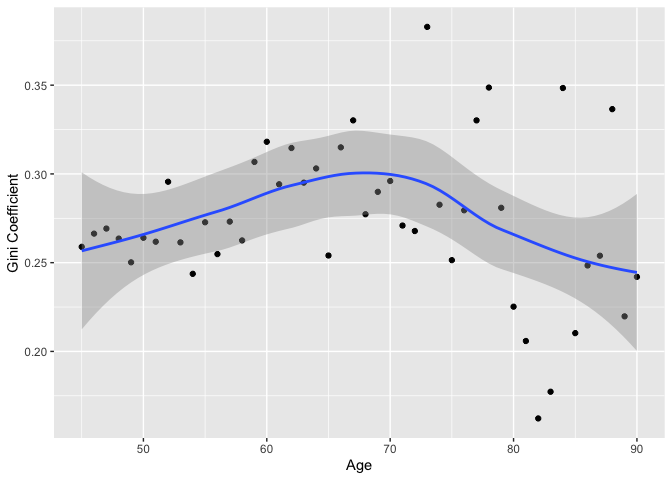<!-- -->

``` r
#__Gini by Age ___ weighted pensions 

WeightedGiniVector= rep(0,times=length(GiniByAge))

for (i in 1:length(GiniByAge))
{
  WeightedGiniVector[i]=(TotPenByAge[i]/sum(TotPenByAge))*GiniByAge[i]
}

max(WeightedGiniVector)
```

    ## [1] 0.01138787

``` r
plot(ActiveUniqueAge, WeightedGiniVector)
```

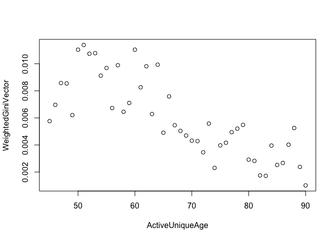<!-- -->

``` r
ActiveData_W <- data.frame(ActiveUniqueAge, WeightedGiniVector)
ggplot(ActiveData_W, aes(ActiveUniqueAge, WeightedGiniVector)) + geom_point() + geom_smooth() + ylab("Gini Coefficient") + xlab("Age") + ylim(0,.025)
```

    ## `geom_smooth()` using method = 'loess' and formula 'y ~ x'

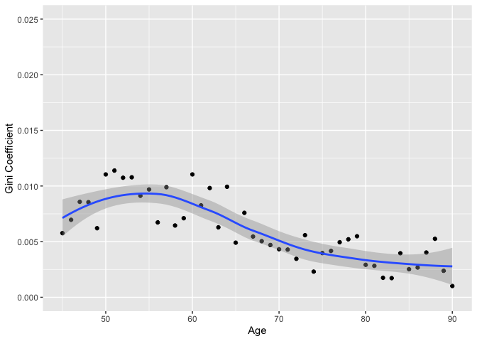<!-- -->

### Calculate Gini by Mosaic Factors

``` r
## Mosaic is Experian’s system for geodemographic classification of households. It applies the principles of geodemography to consumer household and individual data collated from a number of government and commercial sources.

## Unfortunately I currently cannot accest the database so I will just leave the codes here

# Mosaic = read.csv("Mosaic & Regions.csv",header=TRUE) 

## Create variables Mosaic and MosaicBand in SampleData

# SampleData$Mosaic <- Mosaic[match(SampleData$UniqueID, Mosaic$UniqueID), 26] # Both "SampleData" and "Mosaic" data tables have UniqueID column. Use it to find the corresponding Mosaic factor in "Mosaic" data table; "26" means the mosaic factor is in the 26th column of the "Mosaic" data table.
#SampleData$Mosaic[SampleData$Mosaic == "#N/A"|is.na(SampleData$Mosaic)] <- "U" #Replace null values to "U"
#SampleData$MosaicBand <- Mosaic[match(SampleData$UniqueID, Mosaic$UniqueID), 27]
#SampleData$MosaicBand[SampleData$MosaicBand == "#N/A"|is.na(SampleData$MosaicBand)] <- "U"


#gini_Mosaic <- SampleData %>%
#group_by(MosaicBand) %>%
#summarise(count = length(AnnualPensionAmount),
#mean=mean(AnnualPensionAmount),
#median=median(AnnualPensionAmount),
#max=max(AnnualPensionAmount),
#avg_age=weighted.mean(Age,AnnualPensionAmount),
#gini=ineq(AnnualPensionAmount, type="Gini")) %>% 
#add_row(MosaicBand = "Combined", count = length(SampleData$AnnualPensionAmount),
#mean=mean(SampleData$AnnualPensionAmount),
#median=median(SampleData$AnnualPensionAmount),
#max=max(SampleData$AnnualPensionAmount),
#avg_age=weighted.mean(SampleData$Age,SampleData$AnnualPensionAmount),
#gini=ineq(SampleData$AnnualPensionAmount, type="Gini"))

#gini_Mosaic
#write.csv(gini_Mosaic, "GiniResults_ByMosaicBand.csv")
```

## Data Visualization

### Evaluate Distributions - Histogram

``` r
p1 <- ggplot(Sample_Active, aes(x=AnnualPensionAmount)) + geom_histogram() + labs(title="Histogram - Sample") + scale_x_continuous(labels = scales::dollar)

p2 <- ggplot(Sample_Active, aes(x=AnnualPensionAmount, fill=Gender)) + geom_histogram() + labs(title="Histogram - Sample by Gender") + scale_x_continuous(labels = scales::dollar) + guides(fill = guide_legend(reverse = TRUE))

p3 <- ggplot(transform(Sample_Active,
      Gender=factor(Gender,levels=c("M","F"))),aes(x=AnnualPensionAmount)) + geom_histogram(fill="lightblue") + facet_wrap(~Gender) + scale_x_continuous(labels = scales::dollar) 

p4 <- ggplot(transform(Sample_Active,MemberGroup=factor(MemberGroup,                                                levels=c("M","F_P","F_D"))),aes(x=AnnualPensionAmount)) + geom_histogram(fill="Lightblue") + facet_wrap(~MemberGroup) +
  scale_x_continuous(labels = scales::dollar) 


p5 <- ggplot(Sample_Active, aes(x=AnnualPensionAmount, fill=MemberGroup)) + geom_histogram() + labs(title="Histogram - Sample by MemberType") + scale_x_continuous(labels = scales::dollar) + guides(fill = guide_legend(reverse = TRUE))

p1
```

    ## `stat_bin()` using `bins = 30`. Pick better value with `binwidth`.

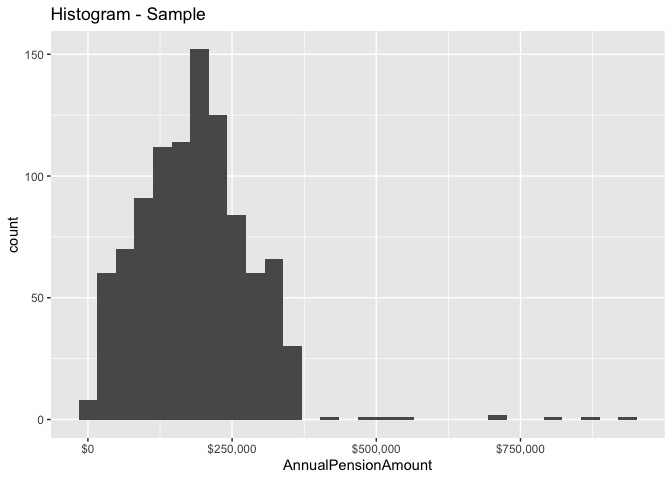<!-- -->

``` r
p2
```

    ## `stat_bin()` using `bins = 30`. Pick better value with `binwidth`.

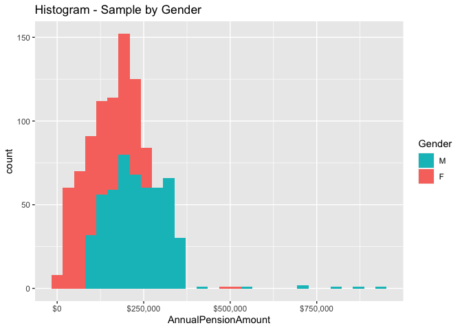<!-- -->

``` r
p3
```

    ## `stat_bin()` using `bins = 30`. Pick better value with `binwidth`.

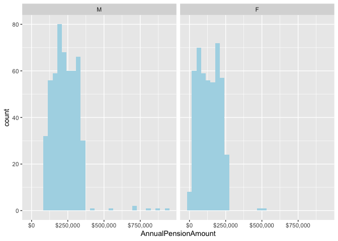<!-- -->

``` r
p4
```

    ## `stat_bin()` using `bins = 30`. Pick better value with `binwidth`.

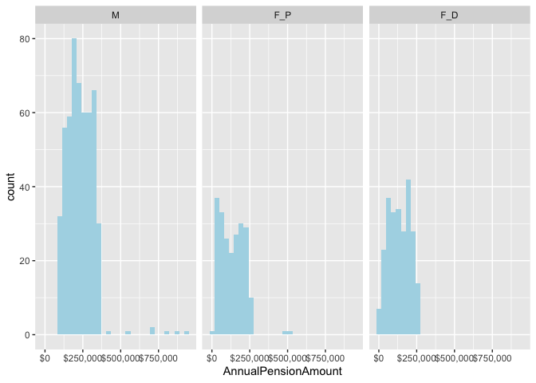<!-- -->

``` r
p5
```

    ## `stat_bin()` using `bins = 30`. Pick better value with `binwidth`.

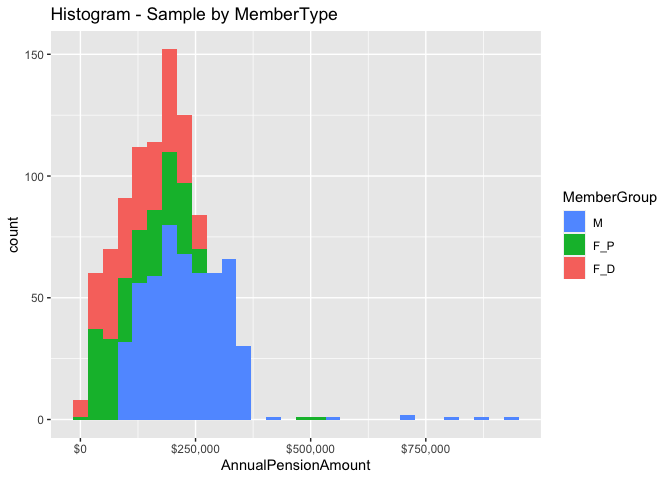<!-- -->

### Evaluate Distributions - Boxplot

``` r
b1 <- ggplot(SampleData, aes(x=1, y=AnnualPensionAmount)) + geom_boxplot() + labs(title="Income Distribution - Project Sample") + scale_y_continuous(labels = scales::dollar)

b2 <- ggplot(SampleData, aes(x=factor(Gender,levels = c("M","F")), y=AnnualPensionAmount, fill=Gender)) + geom_boxplot() + labs(title="Income Distribution - Project Sample by Gender") + scale_y_continuous(labels = scales::dollar) + guides(fill = guide_legend(reverse = TRUE))

b3 <- ggplot(SampleData, aes(x=factor(MemberType,levels = c("P","D")), y=AnnualPensionAmount, fill=MemberType)) + geom_boxplot() + labs(title="Income Distribution - Project Sample by Member Type") + scale_y_continuous(labels = scales::dollar) + guides(fill = guide_legend(reverse = TRUE))

## Females data only
#b4 <- ggplot(subset(SampleData, SampleData$Gender=="F"), aes(x=MemberGroup, y=AnnualPensionAmount, fill=MemberGroup)) + geom_boxplot() + labs(title="Income Distribution - Project Sample by Scheme") + scale_y_continuous(labels = scales::dollar) + guides(fill = guide_legend(reverse = TRUE))

# Transform the pension amount to log(pension amount)
b5 <- ggplot(SampleData, aes(x=1, y=log(AnnualPensionAmount))) + geom_boxplot() + labs(title="Income Distribution - Project Sample - Log Pension Amt") + scale_y_continuous(labels = scales::dollar) 


b6 <- ggplot(SampleData, aes(x=factor(MemberGroup,levels = c("M","F_P","F_D")), y=AnnualPensionAmount, fill=MemberGroup))+ geom_boxplot() + ggtitle ("Income Distribution - Project Sample by Member Group")  + guides(fill = guide_legend(reverse = TRUE)) + ylab("Pension Amount for Banding") + xlab("Member Type") + scale_fill_manual(values=c("#E69F00","#D55E00","#0072B2"))+ scale_y_continuous(labels = scales::comma)
b6_2 <- ggplot(SampleData_ExclLargeClaims, aes(x=factor(MemberGroup,levels = c("M","F_P","F_D")), y=AnnualPensionAmount, fill=MemberGroup))+ geom_boxplot() + ggtitle ("Income Distribution - Project Sample by Member Group_Excl. Records above 99th Percentile")  + guides(fill = guide_legend(reverse = TRUE)) + ylab("Pension Amount for Banding") + xlab("Member Type") + scale_fill_manual(values=c("#E69F00","#D55E00","#0072B2"))+ scale_y_continuous(labels = scales::comma)

b1
```

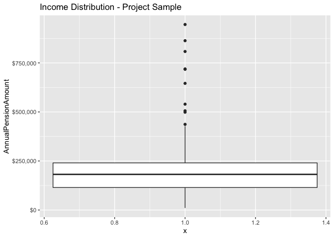<!-- -->

``` r
b2
```

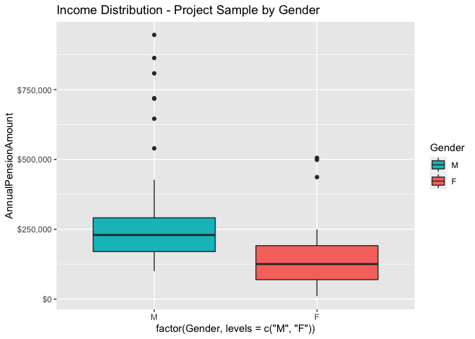<!-- -->

``` r
b3
```

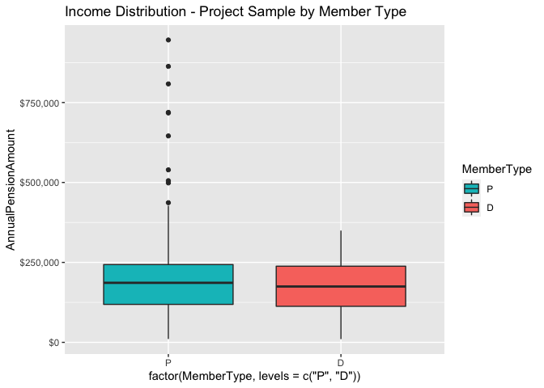<!-- -->

``` r
b5
```

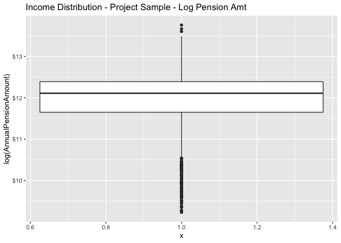<!-- -->

``` r
b6
```

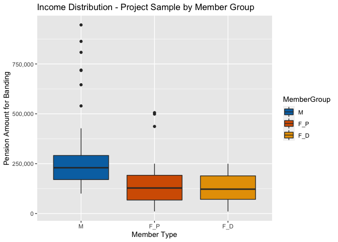<!-- -->

``` r
b6_2
```

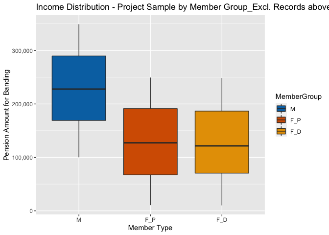<!-- -->

### Q-Q Plot for All Schemes Combined

``` r
#Transform Data
quantile(SampleData$AnnualPensionAmount, p=.99)
```

    ##      99% 
    ## 347599.5

``` r
{qqnorm(SampleData$AnnualPensionAmount,main="Q-Q Plot All Schemes Combined")
qqline(SampleData$AnnualPensionAmount)}
```

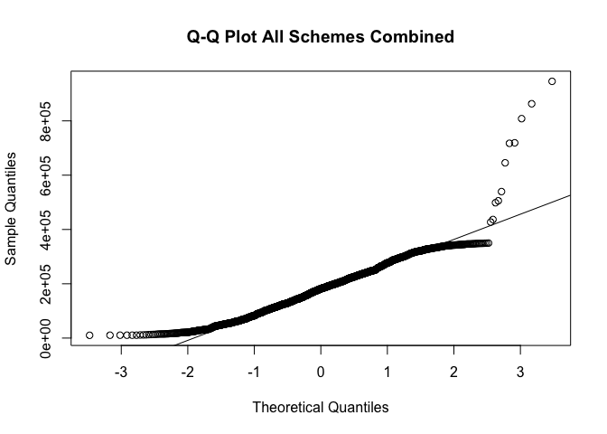<!-- -->

### Income vs. Ages

``` r
M_Data <- SampleData %>% filter((SampleData$Gender=="M"))
F_P_Data <- SampleData %>% filter((SampleData$MemberGroup=="F_P"))
F_D_Data <- SampleData %>% filter((SampleData$MemberGroup=="F_D"))

{plot(SampleData$Age,SampleData$AnnualPensionAmount/1000, pch=16, main="Sample Combined",cex.main = 2.0, xlab="Age", ylab="Pension Amount in Thousand", col="dodgerblue3", xlim=c(30,110), ylim=c(0,1000))
abline(h=mean(SampleData$AnnualPensionAmount)/1000, col="red", lwd=3, lty=2)
text(40, mean(SampleData$AnnualPensionAmount)/1000 + 5,"Mean",col="red")
abline(h=median(SampleData$AnnualPensionAmount)/1000, col="black", lwd=3, lty=2)
text(100, median(SampleData$AnnualPensionAmount)/1000 - 3,"Median",col="black")}
```

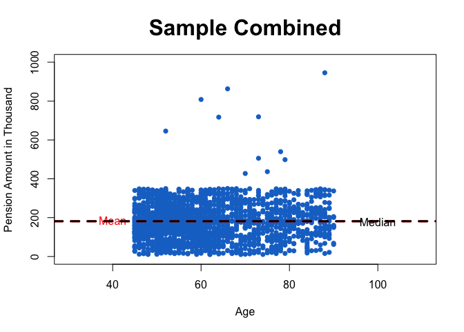<!-- -->

``` r
{plot(M_Data$Age,M_Data$AnnualPensionAmount/1000, pch=16, main="Sample Males",cex.main = 2.0,xlab="Age", ylab="Pension Amount in Thousand", col="dodgerblue3", xlim=c(30,110), ylim=c(0,1000))
abline(h=mean(M_Data$AnnualPensionAmount)/1000, col="red", lwd=3, lty=2)
text(40, mean(M_Data$AnnualPensionAmount)/1000 + 5,"Mean",col="red")
abline(h=median(M_Data$AnnualPensionAmount)/1000, col="black", lwd=3, lty=2)
text(100, median(M_Data$AnnualPensionAmount)/1000 - 3,"Median",col="black")}
```

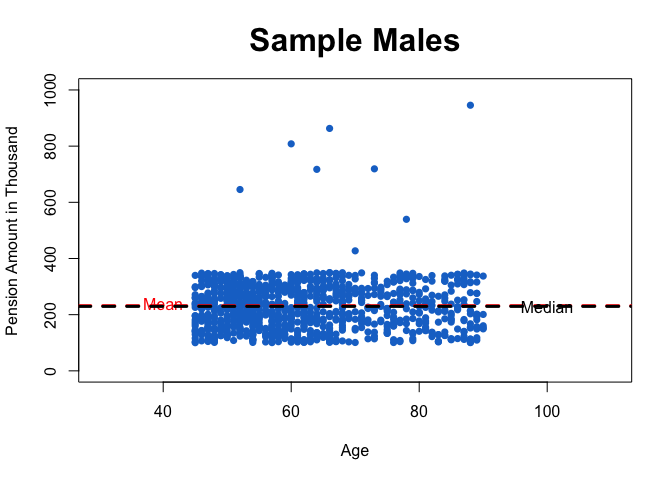<!-- -->

``` r
{plot(F_P_Data$Age,F_P_Data$AnnualPensionAmount/1000, pch=16, main="Sample Female Pensioners ",cex.main = 2.0,xlab="Age", ylab="Pension Amount in Thousand", col="dodgerblue3", xlim=c(30,110), ylim=c(0,550))
abline(h=mean(F_P_Data$AnnualPensionAmount)/1000, col="red", lwd=3, lty=2)
text(40, mean(F_P_Data$AnnualPensionAmount)/1000 + 2,"Mean",col="red")
abline(h=median(F_P_Data$AnnualPensionAmount)/1000, col="black", lwd=3, lty=2)
text(100, median(F_P_Data$AnnualPensionAmount)/1000 - 1,"Median",col="black")}
```

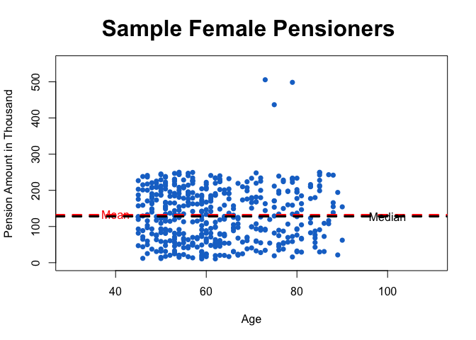<!-- -->

``` r
{plot(F_D_Data$Age,F_D_Data$AnnualPensionAmount/1000, pch=16, main="Sample Female Dependants",cex.main = 2.0,xlab="Age", ylab="Pension Amount in Thousand", col="dodgerblue3",  xlim=c(30,110),ylim=c(0,290))
abline(h=mean(F_D_Data$AnnualPensionAmount)/1000, col="red", lwd=3, lty=2)
text(40, mean(F_D_Data$AnnualPensionAmount)/1000 + 2,"Mean",col="red")
abline(h=median(F_D_Data$AnnualPensionAmount)/1000, col="black", lwd=3, lty=2)
text(100, median(F_D_Data$AnnualPensionAmount)/1000 - 1,"Median",col="black")}
```

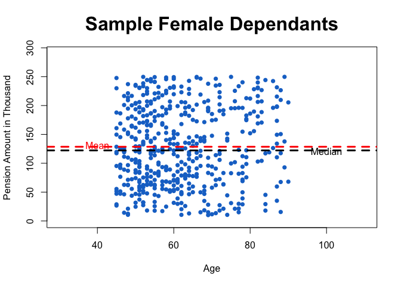<!-- -->

### Lorenze Curve

``` r
M_Data <- SampleData %>% filter((SampleData$MemberGroup=="M"))
F_P_Data <- SampleData %>% filter((SampleData$MemberGroup=="F_P"))
F_D_Data <- SampleData %>% filter((SampleData$MemberGroup=="F_D"))


{par(mfrow=c(1,1))
plot(Lc(SampleData$AnnualPensionAmount),col="gray47",lwd=3, xlab="% of population", ylab="% of wealth",main="Lorenz Curve_By MemberType")
lines(Lc(M_Data$AnnualPensionAmount), col="blue",lwd=3)
lines(Lc(F_P_Data$AnnualPensionAmount), col="brown3",lwd=3)
lines(Lc(F_D_Data$AnnualPensionAmount), col="darkorange1",lwd=3)
legend(.05,.9, c("Perfect Income Equality","Combined (Gini=0.50)","Male (Gini=0.50)","Female-Pen (Gini=0.45)", "Female-Dep (Gini=0.42)"), lty=c(1,1,1,1,1), lwd=c(1,2.5,2.5,2.5,2.5), col=c("black", "gray47","blue", "brown3", "darkorange1"))}
```

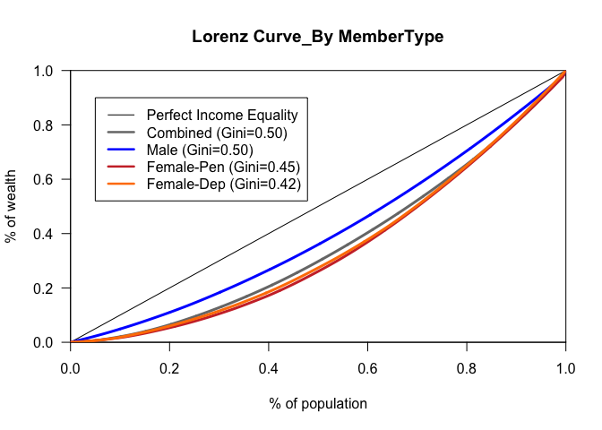<!-- -->
